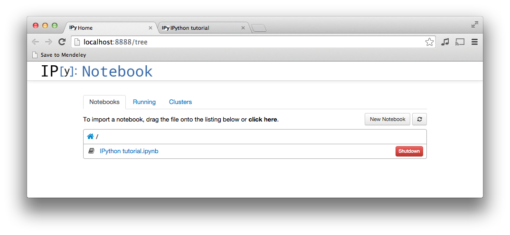
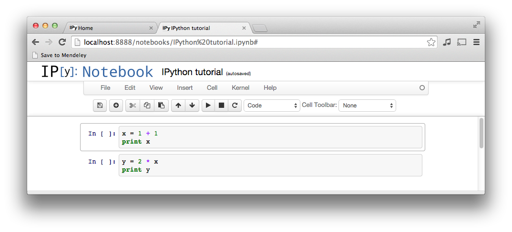
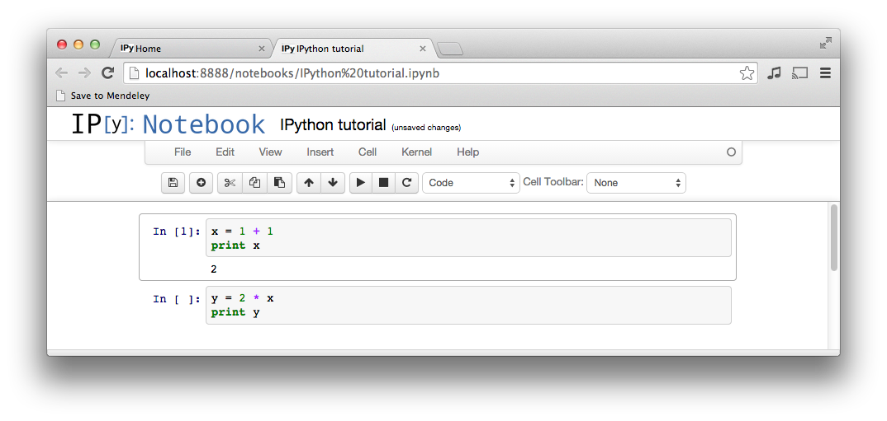
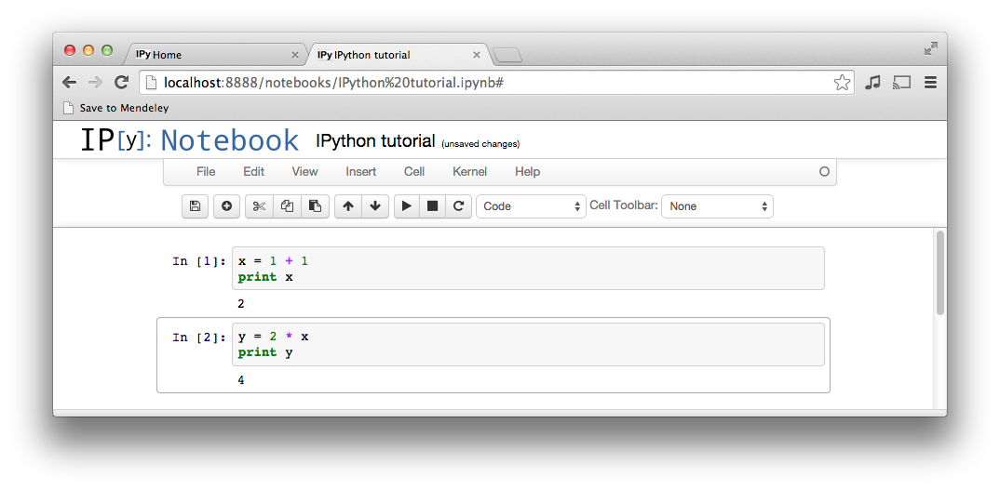
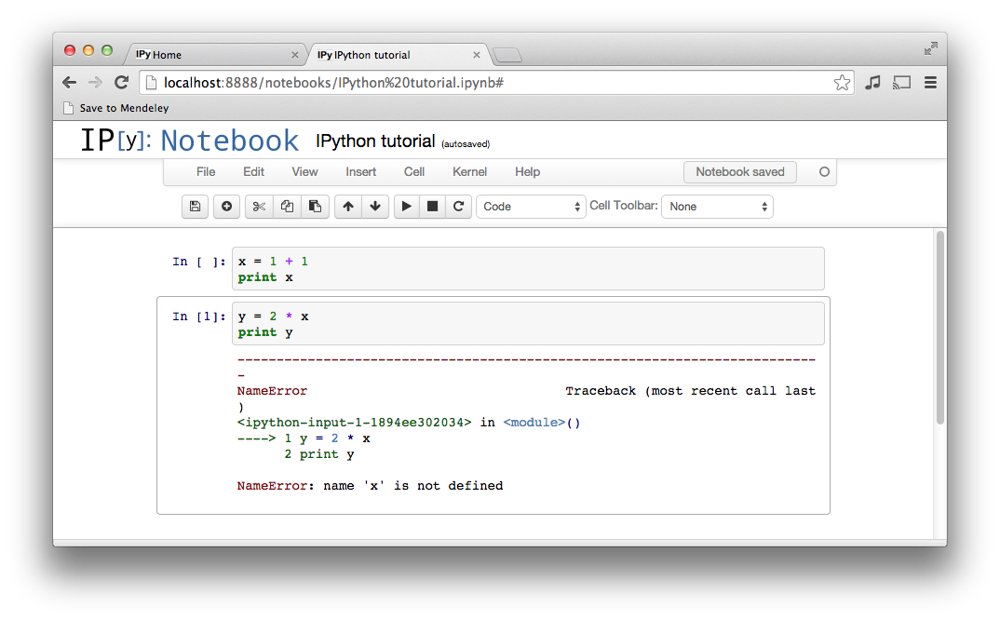
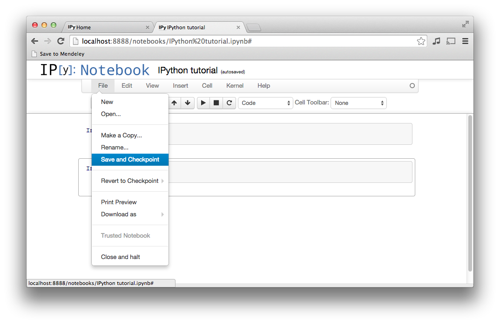

***(Note: some of the screenshots here may be out-of-date. However, this should still prove
useful as a quick intro, and for the general menu layout, etc.)***

In this class, we will use IPython notebooks (more recently known as 
[Jupyter notebooks](https://jupyter.org/)) for the programming assignments. 
An IPython notebook lets you write and execute Python code in your web browser. 
IPython notebooks make it very easy to tinker with code and execute it in bits 
and pieces; for this reason IPython notebooks are widely used in scientific 
computing.

<!---
Once you have it [installed](http://jupyter.org/install.html), start it with this command:
--->

Once you have it installed, start it with this command:

```
jupyter notebook
```

Once your notebook server is running, point your web browser at http://localhost:8888 to
start using your notebooks. If everything worked correctly, you should
see a screen like this, showing all available IPython notebooks in the current
directory:




If you click through to a notebook file, you will see a screen like this:





An IPython notebook is made up of a number of **cells**. Each cell can contain
Python code. You can execute a cell by clicking on it and pressing `Shift-Enter`.
When you do so, the code in the cell will run, and the output of the cell
will be displayed beneath the cell. For example, after running the first cell
the notebook looks like this:





Global variables are shared between cells. Executing the second cell thus gives
the following result:





By convention, IPython notebooks are expected to be run from top to bottom.
Failing to execute some cells or executing cells out of order can result in
errors:





After you have modified an IPython notebook for one of the assignments by
modifying or executing some of its cells, remember to **save your changes!**





This has only been a brief introduction to IPython notebooks, but it should
be enough to get you up and running on the assignments for this course.